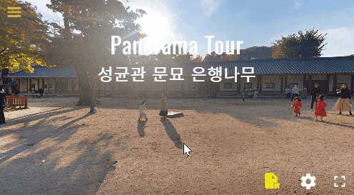

# Panorama Tour Sample
This project is a Panorama VR Viewer learning course.  
This sources are made by a lightweight javascript built on [Panolens.js](https://pchen66.github.io/Panolens/)와 [Three.js](https://threejs.org/).  
[Three.js](https://threejs.org/) is JavaScript 3D Library based on WebGL.  
[Panolens.js](https://pchen66.github.io/Panolens/) is a JavaScript Panorama Viewer from [Three.js](https://threejs.org/).  
This project requires both of them.  




[Web](http://subokim.github.io/panovr) - [Github](https://github.com/subokim/panovr)

## Download
```
git clone https://github.com/subokim/panovr.git
```

## Run
Just html and JavaScript  
use nginx, apache etc ...

## License
This is free. [MIT license](LICENSE).

# 참고

## Ponolens
- Only JavaScript library from three.js without node.js

### Panolens import
```
  <script src="./js/three.js"></script>
  <script src="./js/panolens.min.js"></script>
```
- three.js, panolens.js - All is needed.
- panolens.min.js : mini package of panolens.js

### Panorama object
- Default : SphereGeometry (radius 5,000, height_seg 40 width_seg 60)
- 3D coordinate system : three.js (OpenGL type)
- jpg source : big size ratio 2:1

### Panolens Viewer
- viewer = camera + mouse control + key control ...
- basic camera : THREE.PerspectiveCamera
- FOV default : 60 (1~10,000)

### angle To Vector
```
function getVectorFromAngle(ha, va, radius) {
    //make unit vector(x,y,z)
    let offset = new THREE.Vector3();
    let theta = THREE.Math.degToRad(ha); //horizontal
    let phi = THREE.Math.degToRad(va); //vertical
  
    let vz = new THREE.Vector3(0,0,1); // start point
    let vx = new THREE.Vector3(Math.tan(theta),0,0);
    let vs = Math.sqrt( Math.tan(theta) * Math.tan(theta) + 1); //slop length by x and z;
    let vy = new THREE.Vector3(0, Math.tan(phi) * vs ,0);
  
    offset.add(vz); //start point
    offset.add(vx); // add horizontal angle
    offset.add(vy); // add vertical angle
    offset.normalize();
  
    //multiply radius to unit vector
    offset.x = radius * Math.cos(phi) * Math.sin(theta);
    offset.y = radius * Math.sin(phi);
    offset.z = radius * Math.cos(phi) * Math.cos(theta);
  
    return offset;
}
```
- The coordinate system is from Three.js(OpenGL)
- Goal : input {horizontal_angle, vertical_angle, radius from camera}, output : Vector3{x,y,z}
- default camera position : {0,0,1}
- default angle : radian, not degree.
- step1 : z -> x (horizontal_width) z,x -> y (vertial_height) = the first vector3
- step2 : slope_length -> 1 (the first vector3 -> unit vector3)
- step3 : slope_lenght * radius = from me = target vector line
- step4 : calculate {x,y,z} from target vector line = target vector3 = target position
- camera center control : viewer.tweenControlCenter(target position, 0)
- easing : null = no animation

## Three.js
- [How to make "Hello World".](https://threejs.org/docs/#manual/ko/introduction/Creating-a-scene)
- [Coordinate System](https://horangi.tistory.com/402)
- [Basic Knowledgement](https://ahnheejong.name/articles/my-first-octahedron/)
- [Understand what is Vector](https://docs.unity3d.com/kr/530/Manual/UnderstandingVectorArithmetic.html)

[](https://hits.seeyoufarm.com)
FIN.
